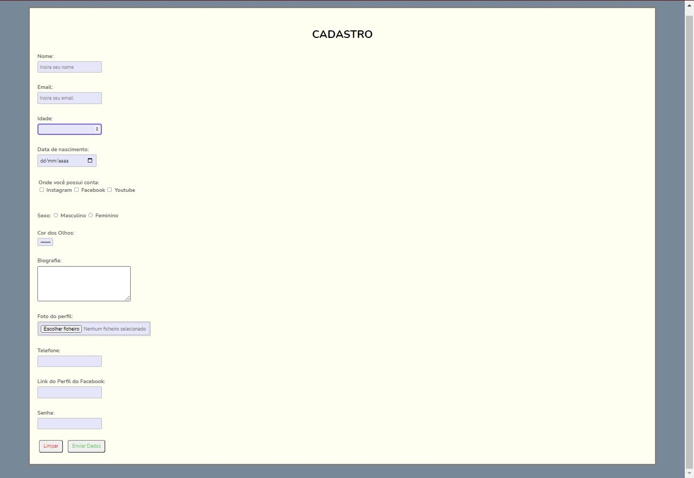

# Form

That's my first form with html and CSS

 

## 🤝 Colaborators

<table>
  <tr>
    <td align="center">
      <a href="#">
         
        
          <b>Mauricio Schimit</b>
        
      </a>
    </td>
</table>
